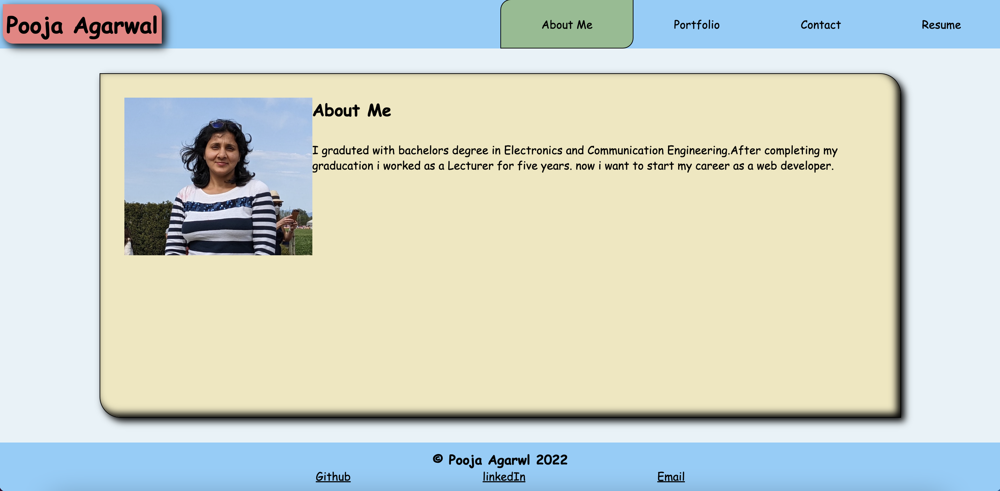

React Portfolio
Description
My first React app! It is a portfolio all about me. It could use some extra work, but it'll do for now.

Table of Contents
Installation
Usage
Screenshot
Credits
License
Contributing
Questions
Installation
Once we have our Github, terminal, and vscode ready to go, we need to: npm i npm start

Usage
Click on tabs to look at my portfolio, about me, contact page, and resume.

https://github.com/mypooja/react-portfolio

Screenshot:

Credits
 W3Schools, Mozilla, and StackOverflow. Thanks to the entire internet for bootstrap help.

License
This application is covered under Creative Commons license. See repo for license.

Contributing
You needn't contribute, but if you'd like to, please follow the rules in the Code of Conduct in repo.

Questions
Link to mypooja's GitHub

Contact Us